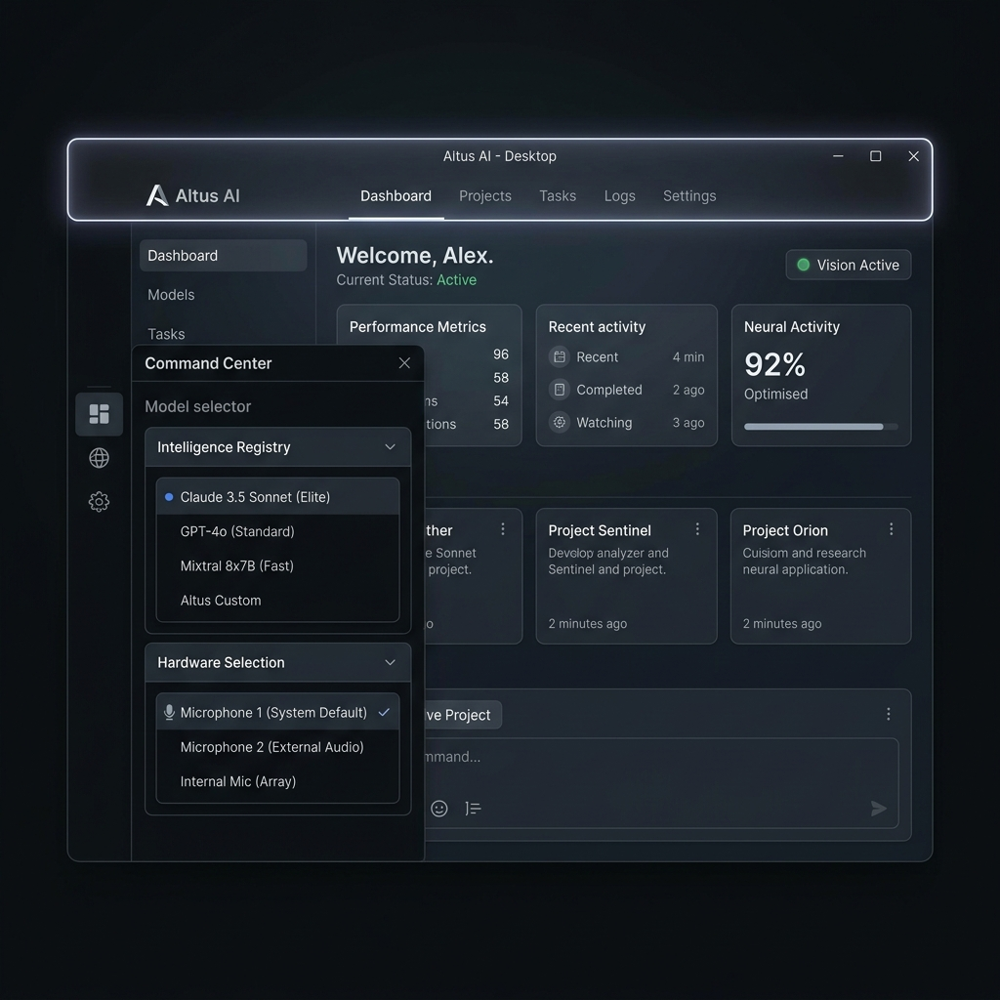
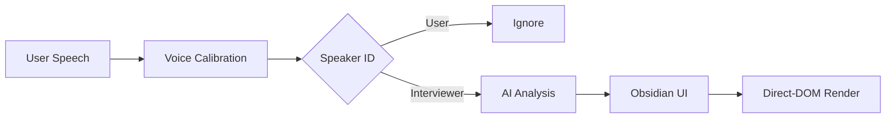
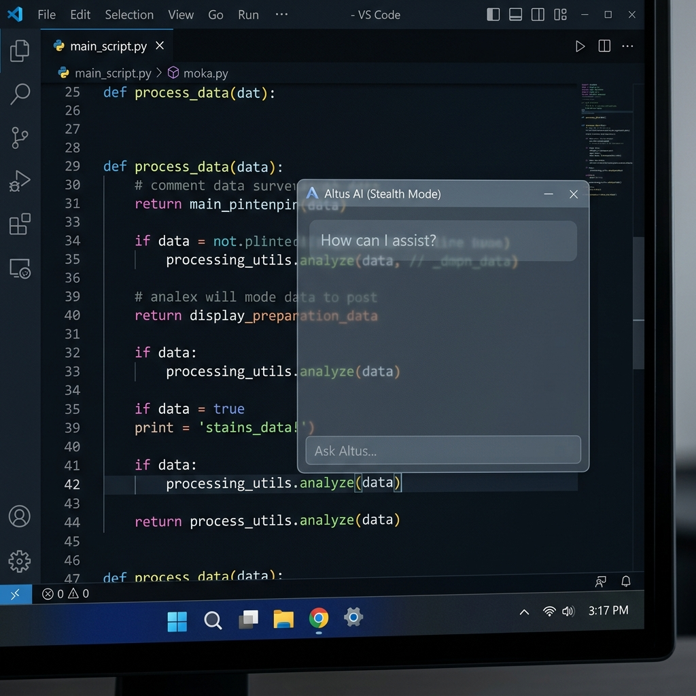

  
  <h1>🛰️ Altus AI: Platinum Edition</h1>
  
<b>The Elite Stealth Interview Assistant for Master Engineers.</b>

  

    
    
    
  

---

## 🌑 Overview

**Altus AI** is a production-hardened, low-latency desktop instrument built for high-stakes technical environments. It combines **Real-time Audio Intelligence** with **System Vision Context** to provide silent, expert guidance during engineering interviews.

  

---

## 💎 The Platinum Feature Suite

### 🎙️ Hardware Command Center
*   **Dynamic Device Selector**: Instantly toggle between microphones or virtual cables via the Obsidian Drawer.
*   **Plug-and-Play Detection**: System-level hardware monitoring automatically refreshes your device list—zero restarts required.

### 🧠 Intelligence Registry
*   **Claude 3.5 Sonnet (Elite IQ)**: The gold standard for system design and edge-case coding.
*   **GPT-4o (High Performance)**: Balanced, rapid-fire technical reasoning.
*   **Model Power Ranking**: Each model is ranked by IQ, Usage Best-Practices, and Cost-tier.

### ⌨️ Professional Hotkey Mapper
*   **Total Sovereignty**: Remap **Vision Capture**, **Ghost Mode**, and **Visibility** to any key combination.
*   **Global Reliability**: Hotkeys work system-wide, even when the application is completely invisible.

### 🌑 Absolute Stealth Sovereignty
*   **Taskbar Invisibility**: Hardened to reside solely in the System Tray and Alt+Tab menu.
*   **Ghost Mode**: Direct-DOM hardware-accelerated transparency—read code *through* the assistant.
*   **Vision Link Pulse**: A subtle, high-tech neon flare activates during screen captures for absolute user transparency.

---

## 🌬️ Smooth Performance
> *Optimized for Zero-Lag Interaction*

*   **Zero-Render Opacity**: Moving the transparency slider now updates CSS variables directly, skipping the React render cycle for buttery-smooth 60fps performance.
*   **GPU Accelerated Auto-Scroll**: AI responses glide into view using `requestAnimationFrame` debouncing to eliminate GPU stutters.

---

## 🚀 Execution Guide

1.  **Launch**: Open `Launch_Altus.bat` to initialize the Obsidian environment.
2.  **Calibrate**: Turn on capture and speak to lock your unique Voice Profile.
3.  **Deploy**: Use your custom hotkeys to trigger Vision support or toggle Ghost Mode.

  

---

  
<b>Altus AI Platinum — Designed for the 1%. Mastery through Intelligence.</b>

  
🚀 <i>Built with Electron, React, and Obsidian Design.</i>

