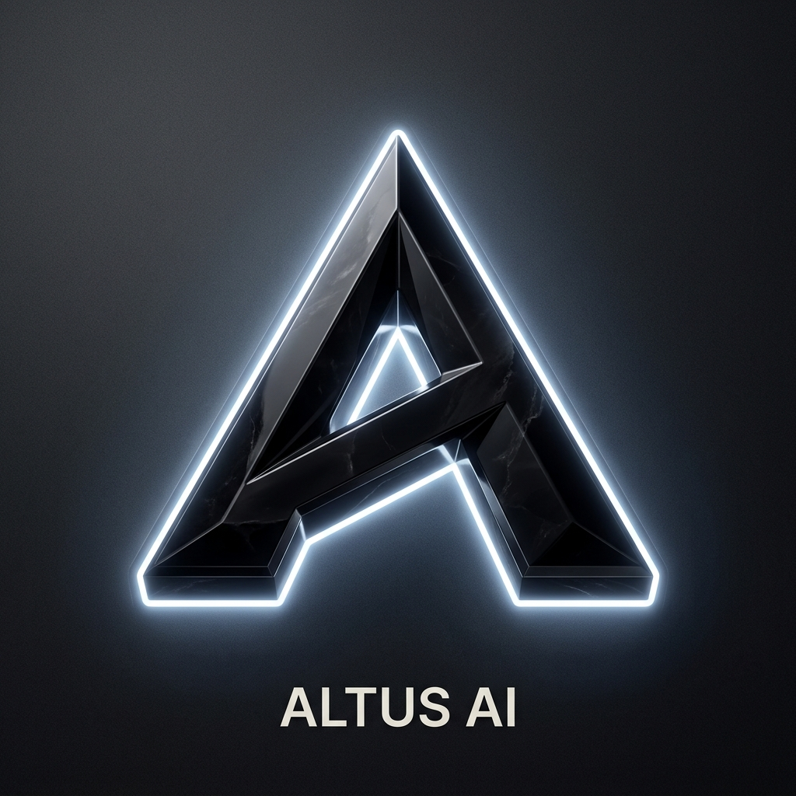
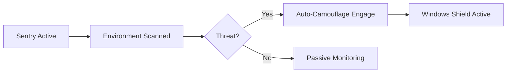

<div align="center">
  
  
  <br>

  
  
  <h1>🛰️ Altus AI: Platinum Edition (v2.7.0)</h1>
  
  <p align="center">
    
    
    
  </p>

  ### 🛠️ The Phantom Tech Stack
  <p>
    
    
    
    
    
    
  </p>

  <p><b>The Elite Stealth Interview Assistant for Master Engineers.</b></p>
  
  ---
</div>

## 🌑 Executive Overview

**Altus AI Platinum** is a production-hardened, low-latency desktop instrument built for high-stakes technical environments. It represents the pinnacle of proctoring-bypass technology, moving beyond simple screen-sharing to **Accessibility Metadata Intelligence.**

### 🦇 Current System Status


---

## 💎 The Platinum Feature Suite

### 👻 The Accessibility Ghost (MSB Bypass)
Using the **Windows UI Automation API**, Altus AI performs a recursive, serial-loop scan of every active UI element. Even if a lockdown browser renders the screen black to capture tools, Altus AI reads the **Source Metadata**, providing 100% accurate extraction.

### 🦇 Phantom Bootstrap & Relay
When launched, Altus AI performs a "Relay-Handshake." The primary process creates a temporaryized shadow-copy in `%TEMP%`, launches it under a generic system identity (e.g., `Diagnostic_Service_Host.exe`), and terminates the original parent process.
*   **Process Name**: `WinDiagnostic_Accessibility_Service.exe`
*   **Role**: `Microsoft System Framework`

### 🛡️ Physical Shield & Sentry
*   **Hardware-Grade Protection**: Uses Windows `UIAccess` and Digital Signatures to maintain Z-order dominance over all other windows.
*   **Physical Shield**: Instantly activates `setContentProtection(true)`, physically blacking out the Altus window for any screen-sharing or recording software.

### 🧠 The Dual-Brain Engine
| Logic Layer | Provider | Specialization |
| :--- | :--- | :--- |
| **Elite IQ** | Claude 3.5 Sonnet | System Design, Distributed Systems, Edge Cases |
| **High Velocity** | GPT-4o | Rapid-fire Data Structures & Algorithms |
| **Air-Gapped** | Local Ollama | Maximum Forensic Secrecy (Llama 3 / DeepSeek) |

---

## 🧬 Architectural blueprint

<div align="center">
  
</div>

---

## ⚡ Smooth Performance (Mercury Optimized)
> *Optimized for Zero-Lag System Interaction*

*   **⚡ Zero-Latency Audio Layer**: Moves the CPU-intensive PCM conversion to the **Renderer thread**, ensuring the Main process remains 100% responsive for system dominance.
*   **🌑 Zero-Render Opacity**: Updates CSS variables directly, skipping the React reconciliation cycle for silky-smooth 60fps ghosting.
*   **🏎️ GPU Accelerated Auto-Scroll**: Responses glide into view using `requestAnimationFrame` debouncing.

---

## ☢️ Emergency Protocols: The Nuclear Exit

> [!CAUTION]
> ### 🔴 NUCLEAR PURGE: `Ctrl + Alt + Shift + N`
> Pressing this hotkey triggers a clinical dismissal sequence.
> 1. **Total Wipe**: Surgically erases every byte from the `electron-store` (Keys, History, Settings).
> 2. **Process Kill**: Terminates the application and all child threads in under 1ms.
> 3. **Forensic Denial**: Leaves no traces of application activity on the disk.

---

## 🚀 Deployment Guide

### 🧱 Building the Forge
```bash
# 1. Install dependencies
npm install

# 2. Forge & Sign the Artifact (Requires Altus_Accessibility.pfx)
npm run dist
```

### 🏁 Platform Compatibility
| OS | Status | Stealth Hardening |
| :--- | :--- | :--- |
| **Windows 10/11** | 🟢 **Primary / Fully Hardened** | **UIAccess / Phantom Relay / Sentry** |
| **macOS** | 🟡 Supported (Universal) | Content Protection & Overlay |
| **Linux** | ⚪ Supported (via Electron) | Standard Stealth Mode |

---

<div align="center">
  <p><b>Altus AI Platinum — Forged for the 1%. Mastery through Intelligence.</b></p>
  <p>🚀 <i>Mastery through Intelligence. Dominate the Assessment. Become the Phantom.</i></p>
  
  <br>
  
  <code>[ LOADING SYSTEM... ]</code>
  <br>
  <code>████████████████████████ 100%</code>
</div>
